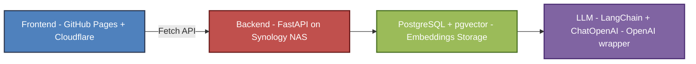

# 🌐 AI CV Assistant – Jorge Chavarriaga  

 
 
 
 
 
 
 
  

This project is an **interactive online CV** powered by a personal AI assistant.  
It combines a **static website** hosted on GitHub Pages with a **FastAPI backend** running on a Synology NAS.  
The assistant answers questions **exclusively** based on two knowledge sources:

- `cv_en.txt` → structured resume (technical profile, work experience, education, skills).  
- `faq_en.txt` → frequently asked recruiter questions.  

---

## 🚀 Project Overview

- **Frontend**: Static CV page with multilingual support and an integrated chat widget.  
- **Backend**: FastAPI application (Dockerized, hosted on Synology NAS) with PostgreSQL + pgvector.  
- **Knowledge base**: CV + FAQ files seeded as embeddings.  
- **AI Assistant**: Uses LangChain + **ChatOpenAI** (OpenAI chat models wrapper) to provide accurate, context-limited answers.  
- **Infrastructure**:  
  - **Domain**: [chavazystem.tech](https://www.chavazystem.tech) via GitHub Pages.  
  - **Reverse Proxy + SSL** handled with Cloudflare.  
  - **Backend API** available at `https://ai.chavazystem.tech/api/v1/`.  

---

## 🖥️ Frontend (GitHub Pages)

- Pure **HTML, CSS, JavaScript** (no framework).  
- **Multilanguage support** via JSON files (`cv_en.json`, `cv_fr.json`, `cv_sp.json`).  
- **Language persistence**: selected language is stored in `localStorage` (`cv_en`, `cv_fr`, `cv_sp`).  
- **Chatbot payload**: always sends the mapped value (`en`, `fr`, `es`) to the backend as `language`.  
- **Response enforcement**: answers are always returned in the selected language, regardless of the question’s language.  
- **Bootstrap + jQuery + FontAwesome** for styling and UI.  
- Integrated **chatbot widget** with:
  - Floating button + modal chat window.  
  - Online/Offline indicator based on `/health/ai`.  
  - Session management via `localStorage` (24h expiration).  

---

## ⚙️ Backend (FastAPI on Synology NAS)

- **FastAPI** REST API, fully **Dockerized**.  
- **PostgreSQL + pgvector** for semantic search.  
- **LangChain + ChatOpenAI** → interaction with OpenAI chat models (`gpt-4`, `gpt-4o`, etc.).  
- Endpoints:
  - `POST /api/v1/ask` → send a question and receive an AI response.  
  - `GET /api/v1/health/ai` → health check (used by frontend to show status).  
  - `GET /api/v1/logs` → manage and query interaction logs.  
- **Services**:
  - `seed_documents.py` → loads CV and FAQ embeddings.  
  - `vectorstore.py` → handles semantic similarity queries.  
  - `log_service.py` → stores interactions in DB.  

---

## 🏗️ Architecture

- **Frontend** → Static site with CV + chatbot widget.  
  Stores `selectedLanguage` (cv_en / cv_es / cv_fr) and session data in localStorage,  
  which are included in the payload (`session_id`, `question`, `language`) sent to the backend.  
- **Backend** → FastAPI API exposed via reverse proxy.  
- **DB** → Stores embeddings and logs.  
- **LLM** → Uses LangChain’s `ChatOpenAI` class to call OpenAI chat models.  

---

## 📦 Tech Stack

- **Frontend**: HTML, CSS, JS, Bootstrap, jQuery, FontAwesome.  
- **Backend**: FastAPI, Docker, PostgreSQL, pgvector, SQLAlchemy, LangChain.  
- **LLM Integration**: LangChain + `ChatOpenAI` (wrapper for OpenAI’s GPT models).  
- **Infra**: GitHub Pages, Cloudflare (DNS + SSL), Synology NAS (DS224+).  

---

## 🔒 Key Features

- ✅ Answers strictly limited to CV + FAQ.  
- ✅ Online/Offline status check for assistant.  
- ✅ Dockerized backend for portability.  
- ✅ Cloudflare SSL & domain management.  
- ✅ Multilingual chatbot support (EN, ES, FR): responses are always in the selected language (set via UI selector & stored in localStorage), regardless of the input language  

---

## 📌 Author

**Jorge Chavarriaga**  
- Website: [chavazystem.tech](https://www.chavazystem.tech)  
- LinkedIn: [linkedin.com/in/jorge-chava](https://www.linkedin.com/in/jorge-chava)  
- GitHub: [github.com/jorgechavarriaga](https://github.com/jorgechavarriaga)  

---
